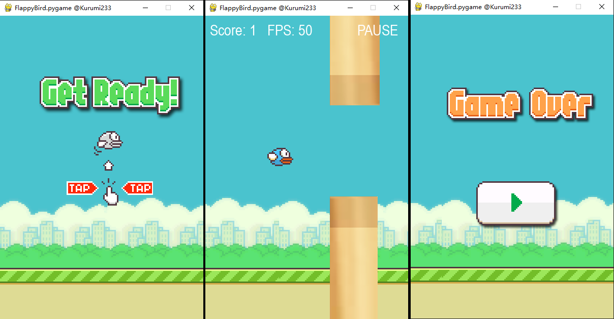

# Flappy Bird python version

### Requirements

- pygame

```bash
pip install pygame
```

### Usage

- 点击鼠标 / 键盘方向键 控制起飞
- 点击右上角PAUSE / 键盘空格键 控制暂停/继续
- 结束后点击重新开始

#### 素材来源

- https://git.nowcoder.com/999991353/fly-bird

### Reference

- [Python游戏编程(Pygame)](https://blog.csdn.net/zha6476003/article/details/82940350)
- [pygame_examples](https://github.com/callmebg/pygame_examples)


